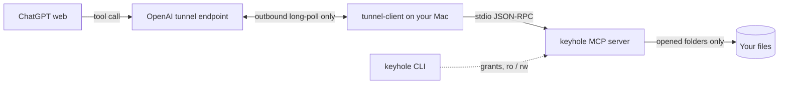

# Keyhole

Let ChatGPT read, and carefully edit, only the local folders you choose. No shell, no public port.

[](https://github.com/L-Jovi/keyhole/actions/workflows/ci.yml)
[](LICENSE)

Keyhole is a small [MCP](https://modelcontextprotocol.io) server that runs on your Mac, plus a command-line
tool, `keyhole`. You open a folder with `keyhole open`; ChatGPT on the web can then read it through OpenAI's
official [Secure MCP Tunnel](https://developers.openai.com/api/docs/guides/secure-mcp-tunnels). Give a folder
`rw`, and ChatGPT can also create and edit text files in it. Every edit is checked against the file's current
hash, applied atomically, recorded, and can be undone.

Unofficial project; not affiliated with OpenAI.

## What you get

- **Read-only by default.** ChatGPT sees a folder only after you open it, and cannot change a file until you
  say `--access rw`. Nothing ChatGPT does can widen its own access: grants are managed by the local CLI only.
- **Careful edits you can undo.** Writes require the file's current SHA-256, so a stale view never overwrites
  newer work. The previous content is kept in a private local history, and `restore_change` rolls it back.
- **Evidence-grade reading.** Text, PDF, Word, PowerPoint, Excel and images come back with hashes and ranges,
  so answers can cite exactly what was read. Document parsers run in a separate process with CPU, memory and
  size limits.
- **No shell, no public endpoint, no third-party relay.** The only network path is the outbound connection
  from OpenAI's tunnel client on your Mac to OpenAI. Close the last folder and the tunnel stops.

## Requirements

Everything Keyhole needs, and exactly what has been verified (as of 2026-09-26). If your setup is in the
"not tested" part, it may well work, but nobody has checked.

| | Needed | Verified |
| --- | --- | --- |
| Computer | A Mac | macOS 15.6 on Apple silicon. Intel Macs and older macOS: not tested. Linux: unit tests only, the real flow is not tested. Windows: not supported; `keyhole` says so and exits. |
| Tools | [Homebrew](https://brew.sh), to install `uv` and OpenAI's `tunnel-client`. Nothing else: no Python, no Git or Xcode command line tools, no tmux, no Node, no Docker. | The Homebrew path, and the no-Homebrew path on a Mac without Xcode command line tools (simulated). |
| Python | None to install. `uv` downloads one for Keyhole; 3.11 or newer works. | 3.11, 3.12, 3.13 and 3.14 in CI; a Mac without Python received 3.14. |
| `tunnel-client` | Any version you accept in `keyhole setup` | 0.0.14, with and without `tmux` installed. 0.0.15 is not tested yet. |
| ChatGPT | An account with **Developer mode** | A Pro account, ChatGPT on the web, Chat mode. OpenAI also lists Plus, Business, Enterprise and Edu; on a team workspace an admin may have to enable Developer mode. Not tested here. |
| OpenAI Platform | An organization where you can create a **tunnel** and a **restricted API key** | One personal organization. |
| Time | About 15 minutes once; afterwards one command to open a folder | |

## How it works



`tunnel-client` is OpenAI's open-source client. It opens an outbound connection and forwards each request to
the Keyhole server over stdio; no port on your Mac is exposed. The server reads and writes only inside folders
you opened, and refuses anything else.

## Install

```sh
brew install uv openai/tools/tunnel-client
uv tool install https://github.com/L-Jovi/keyhole/releases/download/v0.3.1/keyhole-0.3.1-py3-none-any.whl
```

That is all. `uv` brings its own Python, keeps Keyhole in an isolated environment, and links `keyhole` into
`~/.local/bin` (it tells you if that directory is not on your `PATH`). Nothing else on your system changes.

Then, once:

1. Create a tunnel and a runtime key on OpenAI Platform, and run `keyhole setup`. It asks for the tunnel id and
   the key (typed hidden, stored in `~/.config/keyhole/`, mode 0600). Step by step: [docs/setup.md](docs/setup.md).
2. Open a folder:

   ```sh
   keyhole open ~/Documents/project
   ```

   The `runtime` block in the output should show `"ready": true`; that means the tunnel is up.
3. Create your private ChatGPT app: **Settings → Security and login → Developer mode**, then on the Plugins
   page add an app with **Connection: Tunnel** (pick your tunnel) and **Authentication: No Authentication**.
   Details and the reasons behind each choice: [docs/setup.md](docs/setup.md#4-create-your-private-chatgpt-app).
4. In a new chat, type `@` and pick the app (or choose it from the composer's **+** menu), then ask, for
   example:

   > List my workspaces, then read `README.md` in `project` and summarize it.

The app belongs to your ChatGPT account and points at your tunnel; it is not shared with anyone.

## Daily use

```sh
keyhole open ~/Documents/notes                    # read-only
keyhole open ~/code/app --access rw --name app    # editable, shown to ChatGPT as "app"
keyhole open ~/code/app --exclude Private --exclude 'Secret/*'
keyhole access app ro                             # back to read-only
keyhole status                                    # configuration, checks, runtime state
keyhole close --all                               # stop sharing; the tunnel stops too
keyhole resume --all                              # after a reboot, share the saved folders again
keyhole history --limit 20                        # recent recoverable changes
```

Nothing is shared after a reboot until you run `keyhole resume`. Closing or forgetting a folder never touches
its files.

Example requests in ChatGPT:

> Read `app/src/config.py`, fix the typo in the error message, and read the file back to confirm.

> Search `notes` for "invoice", then quote the matching lines with their file paths.

For an edit, ChatGPT reads the file and its hash, proposes the change, and calls `apply_text_patch` or
`write_file`. Whether ChatGPT asks you before a write is ChatGPT's own setting for the app (it asks by
default and can remember your answer for a conversation); check the app's details if you never see a prompt.

## What ChatGPT can do with each file type

| File type | Read | Create, replace, patch | Copy, move, rename, delete, restore |
| --- | --- | --- | --- |
| UTF-8 text: code, Markdown, JSON, YAML, TOML, shell, HTML, CSS, plain text, any other extension not listed below | by line range | yes (`rw`) | yes (`rw`) |
| UTF-16 / UTF-32 text with a BOM | by line range | no, convert to UTF-8 first | yes (`rw`) |
| PDF | text per page, one page as an image; no OCR | no | yes (`rw`) |
| Word `.docx` | body paragraphs and tables | no | yes (`rw`) |
| PowerPoint `.pptx` | slide and table text | no | yes (`rw`) |
| Excel `.xlsx` | cells, formulas and cached values; no recalculation | no | yes (`rw`) |
| PNG, JPEG, WebP | the image, downscaled if large | no | yes (`rw`) |
| Archives, executables, databases, media, legacy Office (`.doc`, `.xls`, `.ppt`) | metadata only | no | yes (`rw`) |

Copy, move, delete and restore treat every regular file up to 8 MiB as opaque bytes, so they work for
binaries too.
Keyhole cannot write Office documents, PDFs or images, and does not run code, macros or formulas.

Limits: text files up to 8 MiB; documents and images up to 64 MiB; 400 lines or 64 KiB per read; 1 MiB per
`write_file`; single files only, no recursive directory operations. Every response says when it was truncated.

## Recovery history

Every change ChatGPT makes is written to `~/.config/keyhole/changes.sqlite3` (readable by you only) before
the file is touched: the paths, hashes and, by default, the previous content. That is what `restore_change`
and `keyhole history` use. ChatGPT can see paths, hashes and change ids, never the stored content.

- History is bounded to 1000 records or 450 MiB. When it is full, the oldest completed records are dropped
  automatically; an interrupted operation is never dropped until you restore it.
- Closing or forgetting a folder keeps its history. `keyhole purge-history --before 2026-01-01 --confirm`
  deletes completed records before a date; nothing else deletes them.
- Prefer your own version control? `keyhole open <dir> --access rw --recovery off` keeps paths and hashes
  only. Edits are still hash-checked and interrupted operations can still be repaired, but `restore_change`
  refuses committed edits for that folder.

## Safety on one screen

- Grants live in `~/.config/keyhole/grants.json` and change only through `keyhole`. There is no remote tool to
  add folders, run commands, use Git, or fetch URLs.
- Names such as `.git`, `.ssh`, `.env*`, `*.key`, `*.pem`, `credentials.json`, `node_modules` and agent
  state directories are hidden at any depth, in any letter case. `keyhole open` prints the full list.
- Your own `--exclude` rules: a pattern without a slash hides matching names at any depth (`Private`,
  `*.log`); a pattern with a slash is anchored at the folder root and hides that subtree (`Secret/*`,
  `docs/*.md`). Matching ignores case and Unicode normalization.
- ChatGPT can never modify Keyhole's own code or environment, the state directory, or shell startup files
  such as `.zshrc` and `.envrc`, whatever spelling of the path it uses.
- Symbolic links, hard-linked files and special files are refused; every path is opened component by
  component with `O_NOFOLLOW` and re-checked before and after each operation.
- Hiding by file name is not secret detection: a token inside a shared source file is readable while the
  folder is open, and anything already sent to ChatGPT cannot be recalled by closing the folder.

Threat model, what is out of scope, and how to report a vulnerability: [SECURITY.md](SECURITY.md).

## Commands and tools

| Command | What it does |
| --- | --- |
| `keyhole setup` | Store the tunnel id and runtime key; `--accept-client-version` after a `tunnel-client` upgrade; `--rotate-key` |
| `keyhole open PATH [--name N] [--access ro\|rw] [--exclude P]... [--recovery on\|off]` | Share a folder and start the runtime; new folders are `ro` |
| `keyhole access NAME ro\|rw` | Change a saved folder's mode |
| `keyhole close [NAME...\|--all]` | Stop sharing; saved paths and history stay |
| `keyhole resume [NAME...\|--all]` | Re-verify saved folders and share them again |
| `keyhole forget [NAME...\|--all]` | Stop sharing and remove the saved configuration |
| `keyhole status` | Configuration, environment checks, runtime state, open folders |
| `keyhole history [--limit N]` | Recent recoverable changes, including interrupted ones |
| `keyhole purge-history --before DATE --confirm` | Permanently delete completed history before a date |

Every command prints JSON; `"ok": false` comes with an `error.code` you can act on.

| Tool ChatGPT calls | Effect |
| --- | --- |
| `list_workspaces` | Open folders, their `ro`/`rw` mode, exclusions and limits |
| `list_directory`, `search_files` | Paged listing; literal search over names or plain text |
| `read_file` | Text ranges, document pages, images, or just the SHA-256 |
| `write_file`, `apply_text_patch` | Create or replace a UTF-8 file; apply exact literal replacements |
| `create_directory`, `copy_file`, `move_file`, `delete_file` | Single-item file operations, each recoverable |
| `list_changes`, `restore_change` | Recent changes and undo |

The five read tools are marked read-only and the seven write tools destructive, which is what ChatGPT's
write confirmation keys on. Full parameters, error codes and limits: [docs/reference.md](docs/reference.md).

## Troubleshooting

| Symptom | What to do |
| --- | --- |
| `not_configured` | Run `keyhole setup`. The state directory is `~/.config/keyhole` unless you pass `--state-dir`. |
| `client_version_changed` | `tunnel-client` was upgraded. Check the release notes, then `keyhole setup --accept-client-version`. |
| `symlink_in_path` | The folder, the state directory, or one of their parents is behind a symbolic link. Use the physical path (`pwd -P`). |
| `permission_denied` on Desktop, Documents or Downloads | macOS is protecting the folder. Allow your terminal app under System Settings → Privacy & Security → Files and Folders, then retry. |
| `runtime_not_ready` or the app says the server is unreachable | `tunnel-client runtimes status keyhole`, then `keyhole resume --all`. `ready: true` locally only means the tunnel is up; test with a real call in ChatGPT. |
| Tools missing in ChatGPT after an upgrade | Open the app's details in ChatGPT and press **Refresh**, then start a new chat. New folders never need a refresh. |

## Glossary

- **Workspace**: one opened folder, shown to ChatGPT under its name. Not a ChatGPT workspace (the team
  account).
- **ro / rw**: read-only / read-write. New folders are `ro`.
- **Runtime**: the `tunnel-client` process that keeps your tunnel connected and runs the Keyhole server.
- **Chat vs Work**: ChatGPT composer modes. Keyhole was tested in plain Chat; Work is not required.

## Non-goals, and when to use something else

Keyhole will not run shell commands, tests or Git, drive your screen, expose a public endpoint, or let the
remote side manage grants. If you use the ChatGPT desktop app, its local Work mode may already cover your
needs on that machine. If you want ChatGPT to run commands in a repository, use a coding-oriented tool.
Keyhole is for ChatGPT on the web, documents as evidence, and careful edits.

## Optional: Codex companion

`skills/keyhole/` is a skill for OpenAI Codex that lets it run `keyhole` on your explicit instruction and
explains the boundaries. Link that directory into `~/.codex/skills/` (the layout Codex discovers);
`.codex-plugin/plugin.json` describes the same skill for Codex's plugin installer. Not needed for ChatGPT.

## Repository

- Tracked: the server and CLI (`src/keyhole/`), tests, docs, the Codex skill. Runtime state, keys, grants and
  recovery history live in `~/.config/keyhole/` and are never part of the repository.
- Maintained by [Jovi](https://github.com/L-Jovi); best-effort, single maintainer. Bugs and ideas:
  [issues](https://github.com/L-Jovi/keyhole/issues). How to work on it: [CONTRIBUTING.md](CONTRIBUTING.md).
  Changes: [CHANGELOG.md](CHANGELOG.md).

## License

[MIT](LICENSE).
