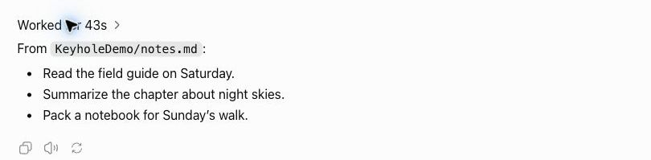
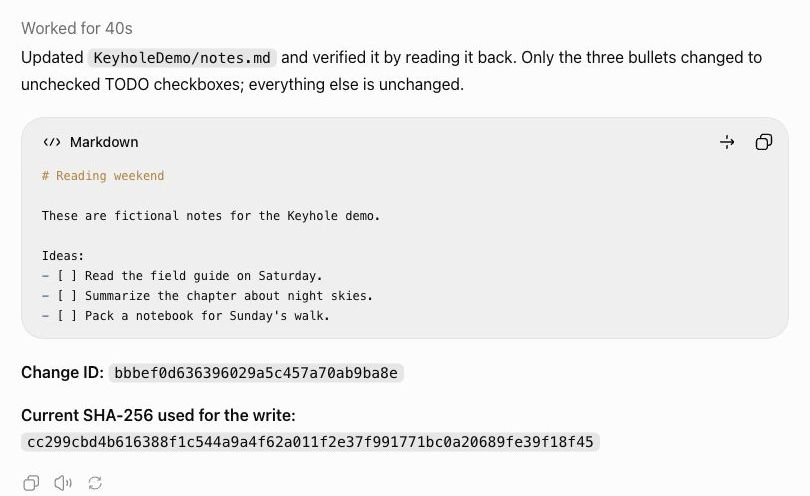
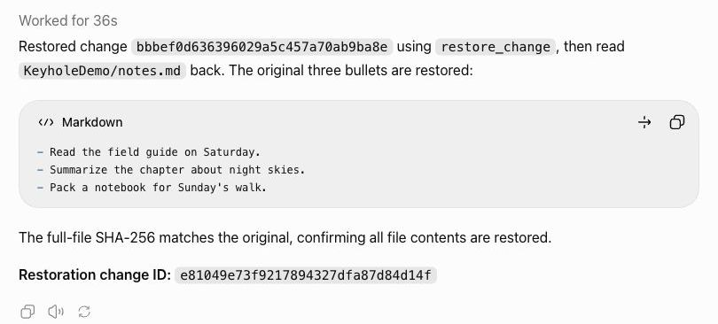
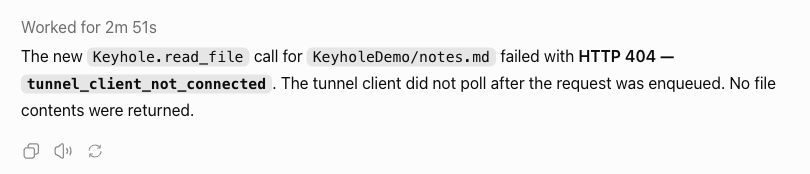

# From a local note to a checklist

Keyhole lets ChatGPT work on a file **where it already lives on your computer**. You choose the folder
in your terminal, ask for a change in ChatGPT, and inspect the result locally. You can restore a retained
change and close access when finished.

The screenshots below come from one real macOS session with fictional notes. They show actual ChatGPT
responses, cropped to the relevant chat content; response text is unchanged. Commands use the portable
example path `./demo-notes`. They are instructions, not a recording of a terminal.

Complete [one-time setup](setup.md) first. This example assumes an existing `demo-notes` folder with a
UTF-8 `notes.md` containing the following text. You can also use the wizard's sample folder, substituting
its actual path and workspace name (`demo`) in the commands and prompts.

```markdown
# Reading weekend

These are fictional notes for the Keyhole demo.

Ideas:
- Read the field guide on Saturday.
- Summarize the chapter about night skies.
- Pack a notebook for Sunday's walk.
```

## 1. Open the folder locally, then read it in ChatGPT

In your terminal:

```sh
keyhole open ./demo-notes --name KeyholeDemo
```

New grants are read-only. In ChatGPT, select your private Keyhole app and ask:

> Read `notes.md` in `KeyholeDemo`. Show the three ideas. Do not edit yet.

ChatGPT reads the local file through the app. The prompt does not include the file's contents:



## 2. Allow an edit locally, then ask ChatGPT to make it

In your terminal:

```sh
keyhole access KeyholeDemo rw
```

In ChatGPT:

> Read the note again, turn its three ideas into Markdown TODO checkboxes, and keep everything else
> unchanged. Use the current file hash for the write, read it back, and give me the change id.

Approve ChatGPT's write confirmation if shown. Keyhole checks the hash before writing and records the
change for recovery:



## 3. Check the file on your computer

In your terminal, run `cat ./demo-notes/notes.md` (PowerShell: `Get-Content .\demo-notes\notes.md`),
or open the file in your editor. The on-disk file from this session was independently checked and read:

```markdown
# Reading weekend

These are fictional notes for the Keyhole demo.

Ideas:
- [ ] Read the field guide on Saturday.
- [ ] Summarize the chapter about night skies.
- [ ] Pack a notebook for Sunday's walk.
```

The file changed on disk; no download or copy-and-paste back from ChatGPT was needed.

## 4. Restore the edit

In ChatGPT:

> Restore the change you just made using its change id. Then read `notes.md` again and confirm that
> the original three bullets are back.

Use the id from **your** edit, not the example screenshot. Restoration needs the folder to remain `rw`
and refuses to overwrite a later external edit.



The local file was checked again: its entire SHA-256 matched the original, not just the three visible lines.

## 5. Close access from your terminal

```sh
keyhole close KeyholeDemo
```

In ChatGPT:

> Make a **new** `read_file` call for `KeyholeDemo/notes.md`. Report the actual failure; do not use the
> file contents already in this conversation.

This was the last open folder in the session, so closing it also stopped the tunnel. The new request
failed without returning file content:



This disconnected request took 2 minutes 51 seconds. If other folders remain open, the tunnel stays up
for them and Keyhole instead refuses access to the closed workspace. Closing access prevents new reads;
it cannot erase content already returned to a conversation.

## What was verified

The session ran on 2026-09-27 with development commit `01054bc`, macOS 15.7.7 on Apple silicon,
Python 3.12.9, official `tunnel-client` 0.0.14 and ChatGPT Pro on the web in Chat mode.
Only the synthetic `KeyholeDemo` folder was opened for this test. Other saved grants were unchanged.

- Original and restored file SHA-256: `cc299cbd4b616388f1c544a9a4f62a011f2e37f991771bc0a20689fe39f18f45`.
- Edited file SHA-256: `c812d1de32ac19a2d1f46fbe6360ac263d57b8f4afccd7f496b9652f9b8cf32e`.
- The four published screenshots contain only synthetic chat results. Desktop, tabs, address bar,
  sidebar, account controls, private paths and unrelated conversations are excluded.
- Screenshots were visually checked and exported without private metadata. Raw captures and local
  verification receipts remain outside Git. No generated or rewritten ChatGPT response is used.

This demonstrates the stated macOS workflow. See [platform evidence](platforms.md) for the separate
Linux and Windows acceptance results and their limits.
