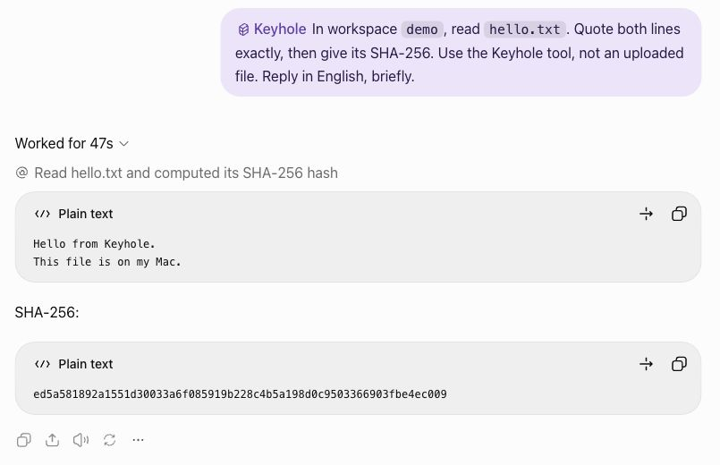

# Your first file in ChatGPT

> The commands on this page require **Keyhole 0.4.0 or later**. Check the
> [published versions](https://github.com/L-Jovi/keyhole/releases) before installing; for 0.3.2, use
> its [versioned setup guide](https://github.com/L-Jovi/keyhole/blob/v0.3.2/docs/setup.md).
> Do not install the unrelated PyPI package `keyhole`.

Follow this page from top to bottom. The goal is one real ChatGPT read of a fictional note in a folder
you deliberately shared. No personal documents are needed to try it.

## 1. Check access before installing

- **macOS or Ubuntu Linux.** Apple silicon on macOS 15.6/15.7.7 and Ubuntu 24.04 x86_64 have real
  ChatGPT acceptance. Ubuntu 22.04 has automated coverage; Intel Macs, older macOS, other Linux
  distributions and Linux ARM are untested. Windows is unsupported. See [platform evidence](platforms.md).
- **ChatGPT web with Developer mode.** Tested with Pro in Chat mode; other eligible plans and fresh-account
  onboarding are untested here. A workspace administrator may need to grant access.
- **OpenAI Platform tunnel permissions.** Creating a tunnel needs **Tunnels: Read + Manage**; the runtime
  key and the person selecting the tunnel in ChatGPT need **Read + Use**.

ChatGPT and Platform are two product surfaces; you do not necessarily need two different accounts.
A ChatGPT subscription alone does not establish Platform permissions. Check the current
[official guide](https://developers.openai.com/api/docs/guides/secure-mcp-tunnels) if the controls are absent.
Keyhole cannot enable these permissions for you.

## 2. Install Keyhole

If you already have `uv`, skip its installation. On macOS you can use Homebrew (`brew install uv`);
on either macOS or Linux you can use the
[official standalone installer](https://docs.astral.sh/uv/getting-started/installation/):

```sh
curl -LsSf https://astral.sh/uv/install.sh | sh
export PATH="$HOME/.local/bin:$PATH"
uv --version
```

Install the published package:

```sh
uv tool install keyhole-mcp
export PATH="$HOME/.local/bin:$PATH"
keyhole --version
keyhole setup
```

If PyPI is unavailable, replace `keyhole-mcp` in the install command with the exact `.whl` URL from
the [release page](https://github.com/L-Jovi/keyhole/releases). Check that the selected release is
0.4.0 or newer before using this guide. A release wheel needs no Git or development toolchain.
Maintainers testing an unreleased, reviewed checkout can use `uv tool install .` instead.

`uv` supplies Python when needed and isolates dependencies. The command is normally in `~/.local/bin`;
Homebrew itself uses its own prefix. If `uv` uses a custom bin directory, use `uv tool dir --bin` to find it.
The `export` above affects this terminal only. To keep the command in new terminals, explicitly run
`uv tool update-shell` and reopen your terminal; that command edits your shell startup file.
Check `keyhole --version` in the new terminal before continuing.

Do not install `tunnel-client` separately unless you prefer to maintain it yourself. Setup can download
the verified official bundle for your OS and architecture, after showing its size and location and asking
for permission. It verifies the pinned SHA-256 and preserves the official licenses. No sudo is needed.
Existing clients are shown with their version and location; Homebrew installations remain externally managed.

## 3. Follow the terminal wizard

Use `keyhole setup --no-browser` if you prefer to open links yourself. The wizard prints these steps:

1. Open [Platform → Organization → Tunnels](https://platform.openai.com/settings/organization/tunnels).
   Create a tunnel, for example `keyhole-laptop`, and associate **only your intended ChatGPT workspace**.
   Other authorized members of that workspace may also be able to select the tunnel.
2. Paste its `tunnel_...` id into the terminal. This is a Platform resource, not the GitHub repository URL.
3. Open [Organization → API keys](https://platform.openai.com/settings/organization/api-keys). Create a
   **restricted runtime key with Tunnels: Read + Use**, not an admin key. Paste it at the hidden terminal
   prompt; nothing should appear as you type. Never paste a key into ChatGPT or an issue.
4. Accept the optional sample-folder prompt to create and share a **new** `~/KeyholeDemo` read-only,
   shown as `demo`. It contains `notes.md` with three fictional ideas. If the directory or workspace name
   already exists, setup stops that step without overwriting or sharing it implicitly.

Setup records the key privately, with file mode `0600` inside a `0700` state directory. It remembers the
client path, so there is no second executable to add to PATH. Rerunning setup reuses complete values and
continues missing steps; it does not reset grants or recovery history. Cancelled downloads can be retried.
If you skip the sample, open one intended folder yourself with `keyhole open /absolute/path --name demo`.

**Expected:** local configuration is saved, then opening the sample reports `"ready": true` and `"access": "ro"`.
Configuration saved does not validate remote permissions; readiness does not prove a ChatGPT read.

**If blocked:** run `keyhole status --human` and follow its next step. Download failures should be retried,
not worked around by disabling checksum checks. A missing saved client path does not silently fall back to
another installation. For a new explicit path, run `keyhole --tunnel-client /absolute/path setup`.
If sample creation succeeded but its connection failed, keep the files and use the exact `keyhole open`
retry command printed by the error. There is no need to delete or recreate the sample.

## 4. Create your private ChatGPT app

The demo must be open while creating the app; `keyhole open` starts the official runtime in the background.
There is no extra terminal server command to keep running.

1. In ChatGPT web, enable **Developer mode** in Settings (currently **Security and login**).
2. Open **Plugins**, press **+**, and create an app for your own MCP server. Name it **Keyhole**.
3. Use this description:

   > Read only the local folders I open. Explicit local rw grants allow hash-checked text edits with recovery. No shell or public port.

4. Select **Connection: Tunnel**, then your tunnel. If absent, check workspace association and your
   Platform **Tunnels: Read + Use** permission. Creating a key alone does not associate a workspace.
5. Select **Authentication: No Authentication** for the MCP server. The OpenAI tunnel and its workspace
   association authenticate access; Keyhole does not add another login. Keep write confirmations enabled.
6. Save. If discovery fails, inspect `keyhole status --human`, fix its reported issue and retry.

The app is private to your setup. Secure MCP Tunnel does not provide public plugin-store distribution.
For a renamed existing Local Evidence Bridge app, keep its tunnel and edit its name/description.

## 5. Read your first file

Start a new **Chat** conversation, type `@Keyhole`, and select the actual app from the menu. Typing its
name as ordinary text does not connect it. Then send:

> In workspace `demo`, read `notes.md` using Keyhole. Quote the three ideas and give the SHA-256.

**Success:** ChatGPT makes a real `read_file` call and returns the same three ideas as your local file.
A generic “I can access files” statement is not evidence. If no tool is called, check the selected app and
start a new conversation. Use [diagnostics](../README.md#troubleshooting) for an actual tool failure.


The following earlier acceptance example read a synthetic `hello.txt`; the new wizard uses `notes.md`:



Setup is complete after the successful read. To stop now, run `keyhole close demo`.

## Optional: edit, restore, and close

Only the local CLI can allow editing:

```sh
keyhole access demo rw
```

Ask ChatGPT:

> Read `demo/notes.md` again. Turn the three ideas into a Markdown TODO checklist. Keep everything else
> unchanged, use the current hash, and show the change id. Read it back to confirm.

Inspect the local file, then ask ChatGPT to restore that change id and read it again. Recovery refuses to
overwrite a later external edit; history is bounded and is not a permanent backup. Finally:

```sh
keyhole close demo
```

Ask for a **new tool call** reading `demo/notes.md`. It must fail; closing the last folder stops the runtime,
so the app may instead become unavailable. Existing chat content remains in the conversation.

For help, `keyhole status --redact` produces an issue-safe diagnostic summary without keys, tunnel ids,
private paths or workspace names. [Maintenance](maintenance.md) covers upgrades, history and uninstall.
