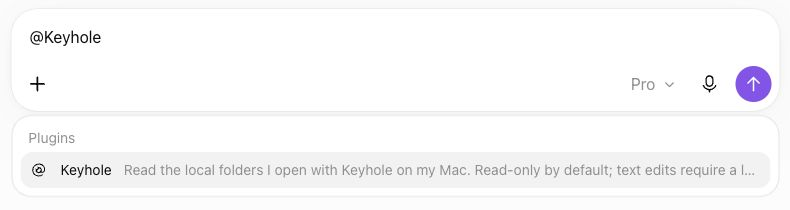

# Your first file in ChatGPT

This is the complete first-time setup. Keep this page open and follow the steps in order; you do not need
to repeat anything in the README afterwards. The examples use one folder, `~/KeyholeDemo`, shown to ChatGPT
as `demo`, and one file, `hello.txt`.

## 1. Check the two accounts you need

- **A Mac.** Apple silicon on macOS 15.6/15.7.7 is verified. Intel Macs and older macOS are untested.
  Windows is unsupported; Linux has only experimental unit-test coverage.
- **ChatGPT on the web, with Developer mode available.** Tested with Pro in Chat mode. On a team workspace,
  your administrator may need to allow it. Check this before installing anything.
- **OpenAI Platform access.** You must be able to create a tunnel (*Tunnels: Read + Manage*) and a restricted
  runtime API key (*Tunnels: Read + Use*). A ChatGPT subscription alone does not establish those permissions.

OpenAI changes its screens and eligibility over time. The official
[Secure MCP Tunnel guide](https://developers.openai.com/api/docs/guides/secure-mcp-tunnels) and
[Developer mode guide](https://developers.openai.com/api/docs/guides/developer-mode) describe current access.
Keyhole cannot enable an account feature or create the website resources for you.

## 2. Install the tools

If Homebrew is already installed:

```sh
brew install uv openai/tools/tunnel-client
```

<details>
<summary>No Homebrew? Use the official standalone downloads instead</summary>

Install `uv`, then make its command available in this terminal:

```sh
curl -LsSf https://astral.sh/uv/install.sh | sh
export PATH="$HOME/.local/bin:$PATH"
```

From OpenAI's [tunnel-client 0.0.14 release](https://github.com/openai/tunnel-client/releases/tag/v0.0.14),
download `SHA256SUMS.txt` and the ZIP for your Mac into Downloads:

| Mac | ZIP |
| --- | --- |
| Apple silicon (M1 or newer) | `tunnel-client-v0.0.14-darwin-arm64.zip` |
| Intel (untested here) | `tunnel-client-v0.0.14-darwin-amd64.zip` |

For Apple silicon, verify and extract it:

```sh
cd ~/Downloads &&
  grep ' tunnel-client-v0.0.14-darwin-arm64.zip$' SHA256SUMS.txt | shasum -a 256 -c - &&
  mkdir -p ~/.local/bin &&
  unzip tunnel-client-v0.0.14-darwin-arm64.zip tunnel-client -d ~/.local/bin
```

The checksum must say `OK`. On Intel use `amd64` in both commands. If `unzip` asks to replace an existing
file, check its version first. This path needs no Git, Python or Xcode command line tools. It was tested in
a simulated environment with developer-tool commands unavailable, not on a freshly erased Mac.

</details>

Then install the current release:

```sh
uv tool install https://github.com/L-Jovi/keyhole/releases/download/v0.3.2/keyhole_mcp-0.3.2-py3-none-any.whl
export PATH="$HOME/.local/bin:$PATH"
keyhole --version
tunnel-client --version
```

`uv` downloads Python when needed and isolates Keyhole's dependencies. The `keyhole` command is normally in
`~/.local/bin`; Homebrew's commands stay in its own prefix (`/opt/homebrew` on Apple silicon or `/usr/local`
on Intel). The `export` line affects this terminal only. To keep Keyhole available in new terminals, run
`uv tool update-shell` once and reopen your terminal; it updates the appropriate shell startup file.

**Use the wheel link above.** `pip install keyhole` installs an unrelated satellite-imagery package.
The Keyhole distribution uses the distinct name `keyhole-mcp`; the command remains `keyhole`.
Keyhole is not currently published to PyPI. Source code on `main` may be ahead of the published wheel.

## 3. Create your tunnel and runtime key

1. On OpenAI Platform, open [Settings → Organization → Tunnels](https://platform.openai.com/settings/organization/tunnels).
   Create a tunnel named `keyhole-macbook`.
2. Associate it only with the ChatGPT workspace you intend to use. Other members with the necessary
   Tunnels permissions in an associated workspace may also be able to select it; use your personal
   workspace for personal files.
3. Copy its **tunnel id**, beginning with `tunnel_`. This is your own Platform resource, not the GitHub URL.
4. In [Organization → API keys](https://platform.openai.com/settings/organization/api-keys), create a
   **restricted** runtime key with **Tunnels: Read + Use**. Do not use an admin key. Keep the key private;
   you will paste it into the hidden terminal prompt in the next step, never into a chat.

The tunnel-creation permissions belong to your account; the narrower Read + Use permissions belong to
the key used by the running client.

## 4. Connect Keyhole and open the demo folder

```sh
keyhole setup
```

Paste your tunnel id, then your runtime key at the hidden prompt. Nothing appears while the key is entered;
press Return. Setup stores the key privately in `~/.config/keyhole/runtime.key` with mode `0600` and records
the installed client version. If the version differs from tested `0.0.14`, review its release notes before
accepting the prompt. Setup configures local files; it does not create your tunnel or ChatGPT app.

Create the actual file that ChatGPT will read. This command stops if `~/KeyholeDemo` already exists, so it
will not overwrite your files; use a new folder name consistently if needed.

```sh
mkdir ~/KeyholeDemo &&
  printf 'Hello from Keyhole.\nThis file is on my Mac.\n' > ~/KeyholeDemo/hello.txt &&
  keyhole open ~/KeyholeDemo --name demo
```

The output should contain `"ready": true` and `"access": "ro"`. If it reports an error, follow the message
or the [troubleshooting table](../README.md#troubleshooting) before continuing. The first `open` starts the
official tunnel client; there is no server terminal to leave open. Local readiness is only the transport
check. The next steps prove that ChatGPT can actually read your file.

## 5. Create your private ChatGPT app

1. In ChatGPT on the web, enable **Developer mode** in Settings (currently **Security and login**).
2. Open **Plugins**, press **+**, and choose to create an app for your own MCP server.
3. Name it **Keyhole**. Use this description:

   > Read the local folders I open with Keyhole on my Mac. Read-only by default; text edits require a local rw grant. Hash-checked edits with local recovery. No shell execution or public port.

4. Choose **Connection: Tunnel**, then your `keyhole-macbook` tunnel from step 3. Do not enter the repository
   URL. If the tunnel is absent, check its associated ChatGPT workspace and your Platform permissions.
5. Choose **Authentication: No Authentication** for the MCP server. Access is authenticated by OpenAI's
   tunnel connection and workspace association; Keyhole has no separate user login.
6. Keep write confirmations enabled and save. The app contacts your running server while being created.
   If it cannot connect, run `keyhole status` and resolve the reported error before retrying.

This app is private to your setup. A GitHub download does not install a shared app into your ChatGPT account.
If you previously created it as **Local Evidence Bridge**, edit that existing app's name and description in
its Manage page; keep the same tunnel and connection. Renaming the repository or CLI does not rename it.

## 6. Read the file — setup is complete here

Start a **new Chat** conversation, type `@Keyhole`, and select **Keyhole** from the menu (or use the
composer's **+** menu). Merely typing its name as plain text does not select the app.



Then send:

> In workspace `demo`, read `hello.txt`. Quote both lines exactly, then give its SHA-256. Use the Keyhole tool, not an uploaded file.

You should see the two lines you created and a tool result for `read_file`. Check that the text matches.
A generic statement such as “I can access files” is not a successful test.

**You are now connected.** Continue below only if you want to test editing; daily commands are in the
[README](../README.md#daily-use). To stop now, run `keyhole close demo`.

## Optional: edit, restore, and close

The demo starts read-only. Asking ChatGPT to modify it should be refused with `read_only` if it attempts a
write. Only a local command can allow edits:

```sh
keyhole access demo rw
```

In the same chat, ask:

> In `demo`, read `hello.txt` again, append the line `Reviewed with Keyhole.`, and read it back. Show the change id. Then restore that change and read the file once more to confirm the original two lines.

Keep the returned change id. Recovery refuses to overwrite a later external edit; history is bounded, so
it is not a permanent backup. `keyhole history --limit 100` shows recent retained records only: absence from
that list does not prove no change ever occurred.

Finally:

```sh
keyhole close demo
```

Ask ChatGPT to read `demo/hello.txt` again. A new tool call must fail; if this was the last open folder, the
runtime stops and ChatGPT may report the app unavailable. The previous conversation can still remember
content already read. Closing access does not erase that content from the chat.

Optional maintenance is a separate guide: [upgrades, custom paths, recovery and uninstall](maintenance.md).
